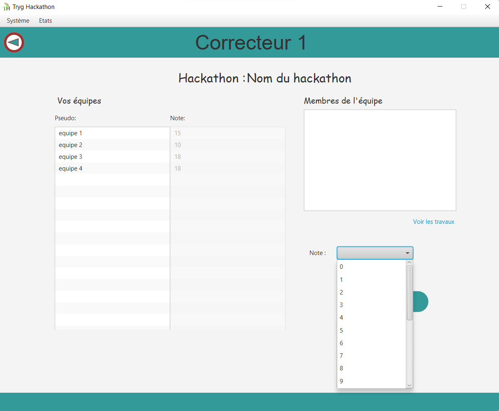
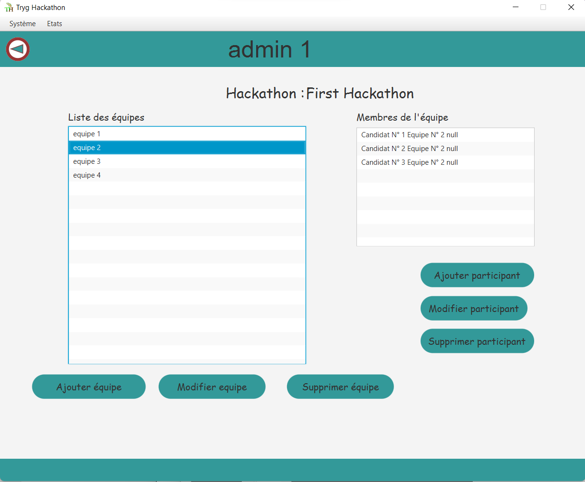
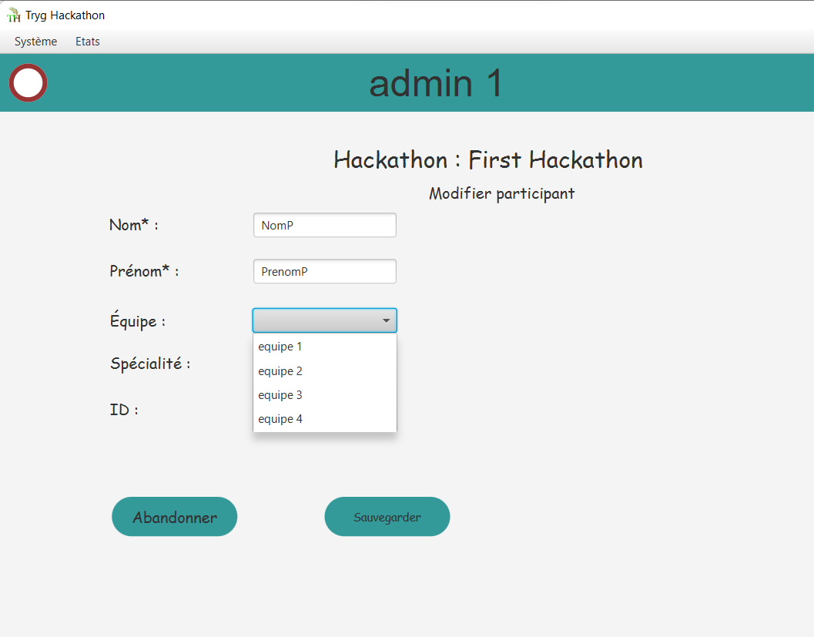
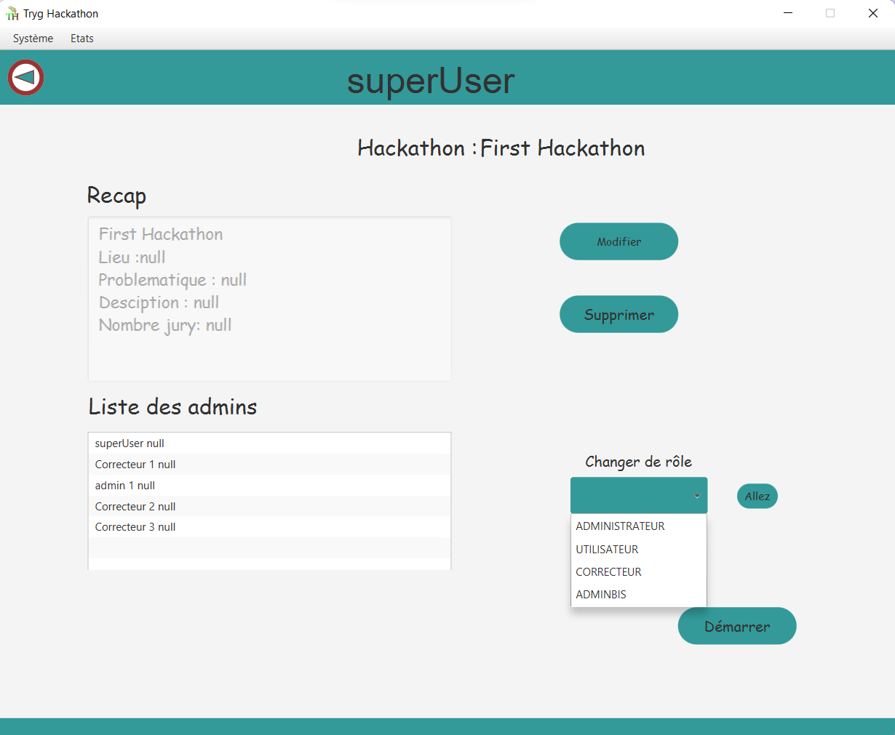
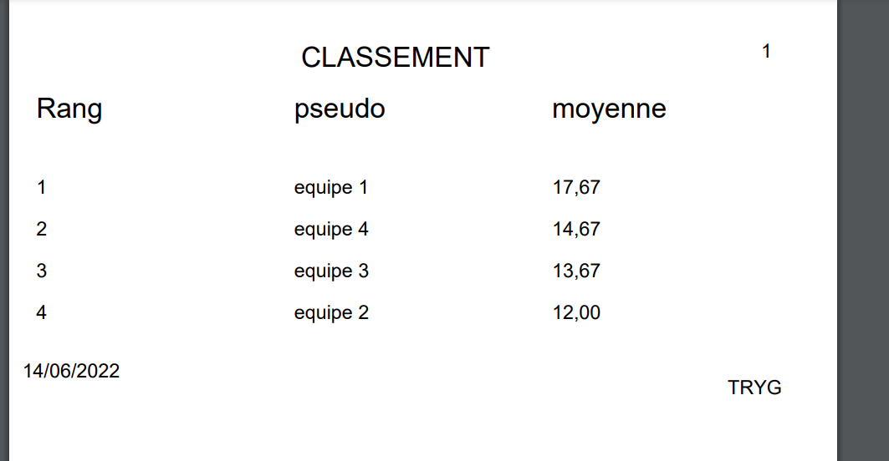

# RyanHackathon

<table>
  <tr>
    <td colspan="2"></td>
  </tr>
  <tr>
    <td></td>
    <td></td>
  </tr>
  
   <tr>
    <td></td>
    <td></td>
  </tr>
  
   <tr>
    <td></td>
    <td></td>
  </tr>
</table>
